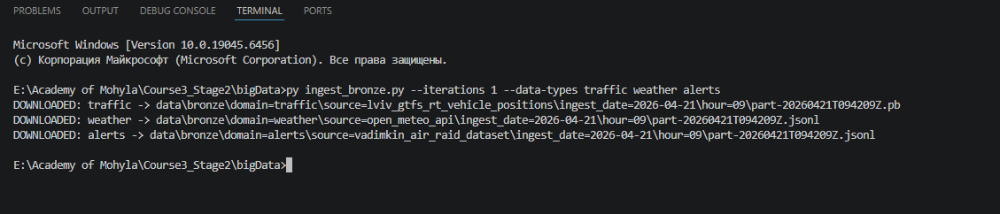
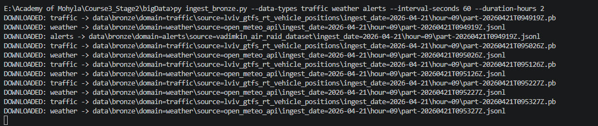

# Bronze Layer Ingest

This document shows how the local ingest script was run and where the collected bronze data is stored.

## Goal

The ingest script downloads data from public internet sources and stores it locally only in the bronze layer.

Supported domains:

- `traffic`
- `weather`
- `alerts`
- `roads`

All output is partitioned by date and hour:

```text
data/bronze/domain=<domain>/source=<source>/ingest_date=YYYY-MM-DD/hour=HH/
```

Each saved file also has metadata with the author's surname:

```json
{
  "author_surname": "Yermolovych"
}
```

## One Iteration Run

For a quick check, the script was started for one iteration:

```powershell
py ingest_bronze.py --iterations 1
```

Example output:

```text
DOWNLOADED: traffic -> data\bronze\domain=traffic\source=lviv_gtfs_rt_vehicle_positions\ingest_date=2026-04-21\hour=09\part-20260421T094116Z.pb
DOWNLOADED: weather -> data\bronze\domain=weather\source=open_meteo_api\ingest_date=2026-04-21\hour=09\part-20260421T094116Z.jsonl
DOWNLOADED: alerts -> data\bronze\domain=alerts\source=vadimkin_air_raid_dataset\ingest_date=2026-04-21\hour=09\part-20260421T094116Z.jsonl
```

Screenshot:



## Continuous Run

To check that the script can collect data over time, it can be started without `--iterations`.
By default, it works for two hours and repeats collection every five minutes:

```powershell
py ingest_bronze.py
```

For a shorter demonstration with repeated downloads, the interval can be reduced:

```powershell
py ingest_bronze.py --data-types traffic weather alerts --interval-seconds 60 --duration-hours 2
```

Screenshot:



## Stored Data

After the script runs, downloaded files can be found in:

```text
data/bronze/
```

Example paths:

```text
data/bronze/domain=traffic/source=lviv_gtfs_rt_vehicle_positions/ingest_date=2026-04-21/hour=09/
data/bronze/domain=weather/source=open_meteo_api/ingest_date=2026-04-21/hour=09/
data/bronze/domain=alerts/source=vadimkin_air_raid_dataset/ingest_date=2026-04-21/hour=09/
data/bronze/domain=roads/source=overpass_osm_kyiv/ingest_date=2026-04-21/hour=09/
```

The `roads` source uses Overpass API. Sometimes this external service can return `504 Gateway Timeout`.
In that case, the script logs `FAILED: roads -> ...` and continues collecting the other domains.

## Notes

- Data is downloaded from the internet and saved locally.
- Data is stored only in the bronze layer.
- The storage format is mixed and source-dependent: `.jsonl`, `.json`, and `.pb`.
- Generated data files are not committed to Git because `data/` is ignored in `.gitignore`.
